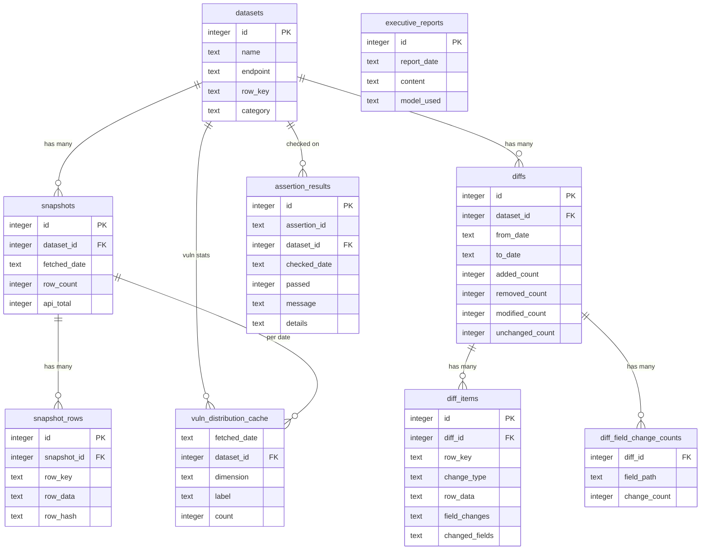

## Data model overview

DayDiff stores daily snapshots, row-level diffs, and quality metadata in a single SQLite database. The core entities are:

- **`datasets`**: configuration and identity for each tracked dataset (applications, resources, vulnerabilities, etc.).
- **`snapshots`**: one row per dataset per fetch date, with aggregate counts.
- **`snapshot_rows`**: individual rows of a snapshot (raw JSON from the source system).
- **`diffs`**: per-dataset comparisons between two consecutive snapshot dates.
- **`diff_items`**: row-level adds/removes/modifications for a diff.
- **`diff_field_change_counts`**: precomputed per-diff field/path change counts for dashboard visualizations.
- **`assertion_results`**: outcomes of automated quality checks over snapshots and diffs.
- **`executive_reports`**: persisted LLM-generated executive summaries.
- **`vuln_distribution_cache`**: precomputed vulnerability distributions (e.g. status/criticality) per date and dataset.

## Entity–relationship diagram

## Table descriptions

### `datasets`

- **Purpose**: Logical configuration for each tracked feed (e.g. `Resources`, `vulns-Digital One LFI (12430)`).
- **Key fields**:
  - **`id`**: primary key.
  - **`name`**: unique dataset name (used throughout the app and scripts).
  - **`endpoint`**: upstream API path used by the fetcher.
  - **`row_key`**: name of the unique key field in the upstream JSON.
  - **`category`**: grouping (e.g. `platform`, `vulnerability`) used by the dashboard and reports.

### `snapshots` and `snapshot_rows`

- **`snapshots`**: one row per dataset per fetch date, with counts and any fetch warnings.
- **`snapshot_rows`**: the raw records for a given snapshot:
  - `row_key` matches the logical key for the dataset.
  - `row_data` is the full JSON payload from the source.
  - `row_hash` is used to detect changes between snapshots.

### `diffs`, `diff_items`, and `diff_field_change_counts`

- **`diffs`**: summary of changes between two dates for a dataset (added/removed/modified/unchanged counts).
- **`diff_items`**:
  - One row per changed `row_key` in a diff.
  - `change_type` ∈ `added | removed | modified`.
  - `row_data` holds the current (or last-known) full row.
  - `field_changes`/`changed_fields` track per-field before/after values for modified rows.
- **`diff_field_change_counts`**:
  - Pre-aggregated counts of how many rows changed for each `field_path`.
  - Used by the API (`/api/diffs/:id/field-changes`) and the dashboard field-change charts.

### `assertion_results`

- **Purpose**: stores outputs of automated quality checks (population drops, fetch completeness, etc.).
- **Key fields**:
  - `assertion_id`: logical ID of the check.
  - `dataset_id`: which dataset the check applied to (may be `NULL` for global checks).
  - `checked_date`: date the assertion was evaluated.
  - `passed`, `message`, `details`: outcome and context.

### `executive_reports`

- **Purpose**: persisted LLM-generated markdown summaries per `report_date`.
- **Notes**: the dashboard and CLI read from this table when showing historical executive reports.

### `vuln_distribution_cache`

- **Purpose**: precomputed vulnerability distributions so the dashboard can render instantly.
- **Shape**:
  - For each `fetched_date` and `dataset_id`, stores counts for:
    - **`dimension`**: `criticality` or `status`.
    - **`label`**: the bucket (e.g. `CRITICAL`, `HIGH`, `DETECTED`, `RESOLVED`).
    - **`count`**: number of rows in that bucket.

